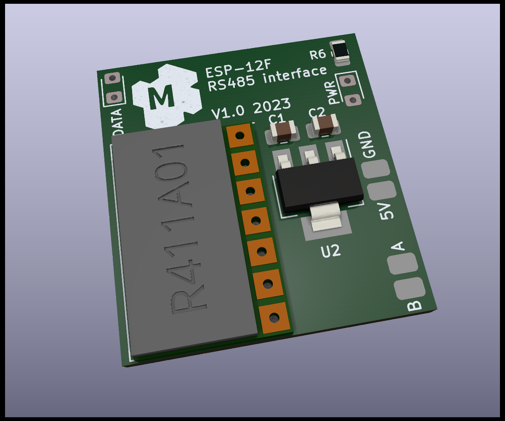
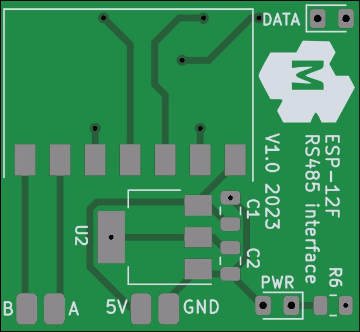

### Dev NOTEs

* before commit, run `./kibot.sh` to regenerate documentation, bom, gerbers and other assets.

* [schematics.pdf](gen/schematics.pdf)
* [pcb.pdf](gen/pcb.pdf)
* [ibom.html](gen/bom_ibom.html)
* [gerbers.zip](gen/gerbers/gerbers.zip)

